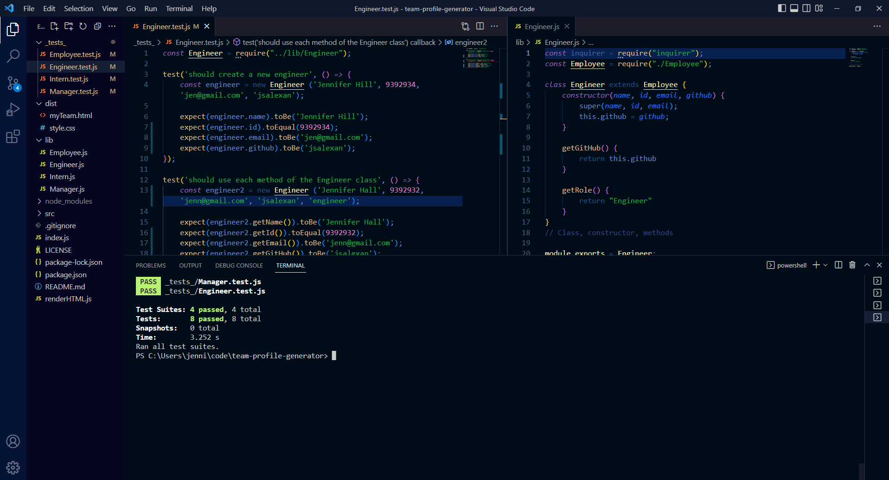

# Team Profile Generator

  ## Badges
  
    
  

  ## Description
  This application assists the user in creating a document with profiles of all their team members. It allows you to include information specific to the employee's role and to see that info printed to the page in the form of cards. 
   

  For my application, I used the following technologies: NodeJS, Inquirer, Jest, JavaScript, Bootstrap, CSS, HTML.
    
  There were a few challenges in creating this application. The assignment required tests to be written, which is new and it is challenging getting them to run correctly. It was also a bit tricky getting the user information to render into separate cards. Then the assignment itself was quite complex to coordinate, with all the various moving pieces.
    
  I am looking forward to finishing the tests and upgrading the CSS for the cards. I think it would be fun to have the employees also submit a picture. Maybe the ID could be autogenerated. I would also like to add more checks to the prompts.
    

## Table of Contents
  - [Installation](#installation)
  - [Usage](#usage)
  - [Credits](#credits)
  - [License](#license)
  - [How to Contribute](#how-to-contribute)
  - [Tests](#tests)
  - [Questions](#questions)
    

  ## [Installation](#table-of-contents)
  There is no website for this application. You may view a demonstration video on [YouTube.](https://youtu.be/nIZkNm52FVI) 
   
  The repository is on GitHub: [GitHub repository for Team Profile Generator.](https://github.com/jsalexan/team-profile-generator)  
  There you will find following file types: 
   HTML, CSS, JavaScript, JSON, README, Images.
    
  Be sure to install Inquirer and Jest.  

## [Usage](#table-of-contents)
  The website (link above) was created to be used on the following devices:  
   _Desktop_  
   

  
    
  
    

  ## [Credits](#table-of-contents) 
  I am grateful for the help of the Panic Problems study (support) group. I also received very helpful assistance from Ben Christiansen and Josh Greiff through the AskBCS Learning Assistant feature and Mark Carlson, our class substitute. Last, I am thankful for the assistance of my **UW Full Stack Web Development Bootcamp** instructors, teacher assistants, and fellow students.
    

  **Third Party References and Tutorials used include:** 
   
  https://www.w3resource.com/jest/expect.php 
  https://www.w3resource.com/jest/using-matchers.php 
  https://www.geeksforgeeks.org/node-js-path-resolve-method/ 
  https://www.freecodecamp.org/news/javascript-switch-case-js-switch-statement-example/
  https://www.npmjs.com/package/inquirer
  https://jestjs.io/docs/getting-started
  https://github.com/jsalexan/readme-gen

   

  ## [License](#table-of-contents)
  **MIT** Copyright 2022, Jennifer Alexander 
  [Information about your MIT license.](https://opensource.org/licenses/MIT)
    
  

  ## [How to Contribute](#table-of-contents)
  I do not wish to have collaborators at this time. Thanks for your interest!
    

  ## [Tests](#table-of-contents)
  There are several tests created to proof the methods created for each Employee class. For example, this one checks to be sure the Employee was created with the correct information: 
  
  The tests can be found in the tests folder. To run them, open an integrated terminal and type "npm test". The results can be seen in this screenshot. Also, be sure you have Jest installed.
    

  ## [Questions](#table-of-contents)
  If you have any questions or comments, please contact  Jennifer Alexander at jennifersalexander@gmail.com  or visit my profile at [GitHub](https://github.com/jsalexan/).
  